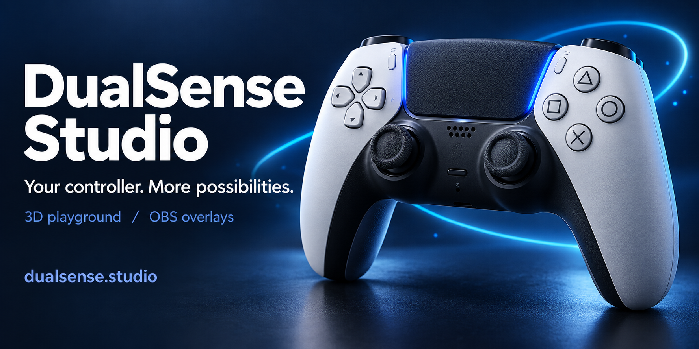

**Public playground edition.** This repository contains the controller playground. Streamer mode and the community gallery remain available on [dualsense.studio](https://dualsense.studio); their implementation is maintained separately.

# DualSense Studio

**Your PS5 controller, with more to play with.**

Explore it in 3D, test your aim, or turn the touchpad into a canvas. All in your browser.

**[Try DualSense Studio →](https://dualsense.studio)**

## Make every input count

- **Explore in 3D.** Rotate the controller, press buttons, move the sticks, and make it your own with custom colors.
- **Check your controller.** Measure resting sticks, trace circularity, run a guided hardware checkup, and download your results.
- **Find your balance.** Roll through three marble mazes using controller tilt, a stick, or arrow keys.
- **Find your aim.** Take on target practice, climb the community leaderboard, and share your scorecard.
- **Paint with your touchpad.** Draw glowing trails and save your creation.
- **Feel and move.** Experiment with adaptive triggers, gyro controls, and your controller's light.

## Jump in

Open **[dualsense.studio](https://dualsense.studio)**, connect your controller over USB or Bluetooth, and press a button. You can explore the virtual controller without hardware, too.

For battery status, gyro, touchpad finger tracking, and adaptive triggers, use desktop Chrome or Edge and allow controller access when prompted.

## Support Safa’s projects

Free to use. Built independently by [Safa](https://github.com/SafaElmali).

Your support helps me keep building DualSense Studio, free tools, and creative experiments.

[Buy me a coffee](https://buymeacoffee.com/safaelmali)

## Go deeper

---

3D model by [Taohid Animation](https://sketchfab.com/3d-models/ps5-controller-b7bb9c5102a04cb0b1966c6d02bad7d6), adapted for interaction under [CC BY 4.0](https://creativecommons.org/licenses/by/4.0/). [Full credits](controller/ATTRIBUTION.md).

Independent project. Not affiliated with Sony, PlayStation, or OBS.
